# Database Schema Documentation - LMS E-book System

## Overview
Dokumentasi ini berisi rangkuman lengkap dari seluruh tabel database dalam sistem LMS E-book, termasuk struktur tabel, kolom, dan relasi antar tabel.

## Entity Relationship Diagram (ERD)

```mermaid
erDiagram
    %% Core User Management
    users {
        bigint id PK
        string name
        string photo
        string whatsapp_number
        string email UK
        timestamp email_verified_at
        string password
        string remember_token
        timestamp email_verified_at
        timestamp whatsapp_verified_at
        string verification_code
        timestamp verification_expires_at
        timestamp created_at
        timestamp updated_at
    }

    password_reset_tokens {
        string email PK
        string token
        timestamp created_at
    }

    sessions {
        string id PK
        bigint user_id FK
        string ip_address
        text user_agent
        longtext payload
        integer last_activity
    }

    %% Permission System
    permissions {
        bigint id PK
        string name
        string guard_name
        timestamp created_at
        timestamp updated_at
    }

    roles {
        bigint id PK
        string name
        string guard_name
        timestamp created_at
        timestamp updated_at
    }

    model_has_permissions {
        bigint permission_id FK
        string model_type
        bigint model_id
    }

    model_has_roles {
        bigint role_id FK
        string model_type
        bigint model_id
    }

    role_has_permissions {
        bigint permission_id FK
        bigint role_id FK
    }

    %% Course Management
    categories {
        bigint id PK
        string slug
        string name
        timestamp deleted_at
        timestamp created_at
        timestamp updated_at
    }

    courses {
        bigint id PK
        string slug
        string name
        string thumbnail
        text about
        boolean is_popular
        bigint category_id FK
        integer price
        integer admin_fee_amount
        integer original_price
        timestamp deleted_at
        timestamp created_at
        timestamp updated_at
    }

    course_benefits {
        bigint id PK
        string name
        bigint course_id FK
        timestamp deleted_at
        timestamp created_at
        timestamp updated_at
    }

    course_sections {
        bigint id PK
        string name
        bigint position
        bigint course_id FK
        timestamp deleted_at
        timestamp created_at
        timestamp updated_at
    }

    section_contents {
        bigint id PK
        string name
        text content
        bigint course_section_id FK
        boolean is_free
        string youtube_url
        timestamp deleted_at
        timestamp created_at
        timestamp updated_at
    }

    course_students {
        bigint id PK
        boolean is_active
        bigint user_id FK
        bigint course_id FK
        timestamp deleted_at
        timestamp created_at
        timestamp updated_at
    }

    course_mentors {
        bigint id PK
        boolean is_active
        bigint user_id FK
        bigint course_id FK
        text about
        timestamp deleted_at
        timestamp created_at
        timestamp updated_at
    }

    user_lesson_progress {
        bigint id PK
        bigint user_id FK
        bigint course_id FK
        bigint section_content_id FK
        boolean is_completed
        timestamp completed_at
        integer time_spent_seconds
        timestamp created_at
        timestamp updated_at
    }

    %% Transaction & Payment System
    transactions {
        bigint id PK
        string booking_trx_id
        bigint user_id FK
        bigint course_id FK
        integer sub_total_amount
        integer grand_total_amount
        integer admin_fee_amount
        integer discount_amount
        bigint discount_id FK
        boolean is_paid
        string payment_type
        string proof
        date started_at
        date ended_at
        timestamp created_at
        timestamp updated_at
        timestamp deleted_at
    }

    discounts {
        bigint id PK
        string name
        string code UK
        text description
        enum type
        decimal value
        decimal minimum_amount
        decimal maximum_discount
        integer usage_limit
        integer used_count
        datetime start_date
        datetime end_date
        boolean is_active
        timestamp created_at
        timestamp updated_at
    }

    payment_temp {
        bigint id PK
        string order_id UK
        bigint user_id FK
        bigint course_id FK
        decimal sub_total_amount
        decimal admin_fee_amount
        decimal discount_amount
        bigint discount_id FK
        decimal grand_total_amount
        string snap_token
        json discount_data
        timestamp expires_at
        timestamp created_at
        timestamp updated_at
    }

    %% Settings & Configuration
    whatsapp_settings {
        bigint id PK
        string api_key
        string base_url
        boolean is_active
        text webhook_url
        json additional_settings
        timestamp created_at
        timestamp updated_at
    }

    whatsapp_message_templates {
        bigint id PK
        string name
        string type UK
        string subject
        text message
        json variables
        boolean is_active
        text description
        timestamp created_at
        timestamp updated_at
    }

    midtrans_settings {
        bigint id PK
        string server_key
        string client_key
        string merchant_id
        boolean is_production
        boolean is_sanitized
        boolean is_3ds
        boolean is_active
        text notes
        timestamp created_at
        timestamp updated_at
    }

    %% System Tables
    cache {
        string key PK
        mediumtext value
        integer expiration
    }

    cache_locks {
        string key PK
        string owner
        integer expiration
    }

    jobs {
        bigint id PK
        string queue
        longtext payload
        tinyint attempts
        integer reserved_at
        integer available_at
        integer created_at
    }

    job_batches {
        string id PK
        string name
        integer total_jobs
        integer pending_jobs
        integer failed_jobs
        longtext failed_job_ids
        mediumtext options
        integer cancelled_at
        integer created_at
        integer finished_at
    }

    failed_jobs {
        bigint id PK
        string uuid UK
        text connection
        text queue
        longtext payload
        longtext exception
        timestamp failed_at
    }

    %% Relationships
    users ||--o{ sessions : "has many"
    users ||--o{ course_students : "enrolls in"
    users ||--o{ course_mentors : "mentors"
    users ||--o{ transactions : "makes"
    users ||--o{ user_lesson_progress : "tracks"
    users ||--o{ payment_temp : "creates"

    categories ||--o{ courses : "contains"
    
    courses ||--o{ course_benefits : "has"
    courses ||--o{ course_sections : "contains"
    courses ||--o{ course_students : "enrolled by"
    courses ||--o{ course_mentors : "taught by"
    courses ||--o{ transactions : "purchased in"
    courses ||--o{ user_lesson_progress : "tracked in"
    courses ||--o{ payment_temp : "temp payment for"

    course_sections ||--o{ section_contents : "contains"
    section_contents ||--o{ user_lesson_progress : "tracked in"

    discounts ||--o{ transactions : "applied to"
    discounts ||--o{ payment_temp : "applied to"

    permissions ||--o{ model_has_permissions : "assigned to models"
    permissions ||--o{ role_has_permissions : "assigned to roles"
    
    roles ||--o{ model_has_roles : "assigned to models"
    roles ||--o{ role_has_permissions : "has permissions"
```

## Tabel Database

### 1. Tabel Sistem Inti

#### `users`
Tabel utama untuk menyimpan data pengguna sistem.
- **Primary Key**: `id`
- **Unique Keys**: `email`
- **Kolom Utama**:
  - `name`: Nama lengkap pengguna
  - `photo`: URL foto profil (nullable)
  - `whatsapp_number`: Nomor WhatsApp pengguna
  - `email`: Email pengguna (unique)
  - `password`: Password terenkripsi
  - `email_verified_at`: Timestamp verifikasi email
  - `whatsapp_verified_at`: Timestamp verifikasi WhatsApp
  - `verification_code`: Kode verifikasi
  - `verification_expires_at`: Waktu kadaluarsa kode verifikasi

#### `password_reset_tokens`
Tabel untuk menyimpan token reset password.
- **Primary Key**: `email`
- **Kolom**: `email`, `token`, `created_at`

#### `sessions`
Tabel untuk menyimpan sesi pengguna.
- **Primary Key**: `id`
- **Foreign Key**: `user_id` → `users.id`

### 2. Sistem Permission & Role

#### `permissions`
Tabel untuk menyimpan daftar permission.
- **Primary Key**: `id`
- **Unique Keys**: `name` + `guard_name`

#### `roles`
Tabel untuk menyimpan daftar role.
- **Primary Key**: `id`
- **Unique Keys**: `name` + `guard_name`

#### `model_has_permissions`
Tabel pivot untuk relasi many-to-many antara model dan permission.
- **Composite Primary Key**: `permission_id` + `model_id` + `model_type`

#### `model_has_roles`
Tabel pivot untuk relasi many-to-many antara model dan role.
- **Composite Primary Key**: `role_id` + `model_id` + `model_type`

#### `role_has_permissions`
Tabel pivot untuk relasi many-to-many antara role dan permission.
- **Composite Primary Key**: `permission_id` + `role_id`

### 3. Manajemen Kursus

#### `categories`
Tabel untuk kategori kursus.
- **Primary Key**: `id`
- **Soft Deletes**: Ya
- **Kolom**: `slug`, `name`

#### `courses`
Tabel utama untuk kursus.
- **Primary Key**: `id`
- **Foreign Key**: `category_id` → `categories.id`
- **Soft Deletes**: Ya
- **Kolom Utama**:
  - `slug`: URL slug kursus
  - `name`: Nama kursus
  - `thumbnail`: URL gambar thumbnail
  - `about`: Deskripsi kursus
  - `is_popular`: Flag kursus populer
  - `price`: Harga kursus
  - `admin_fee_amount`: Biaya admin
  - `original_price`: Harga asli sebelum diskon

#### `course_benefits`
Tabel untuk benefit/keuntungan kursus.
- **Primary Key**: `id`
- **Foreign Key**: `course_id` → `courses.id` (CASCADE DELETE)
- **Soft Deletes**: Ya

#### `course_sections`
Tabel untuk section/bab dalam kursus.
- **Primary Key**: `id`
- **Foreign Key**: `course_id` → `courses.id` (CASCADE DELETE)
- **Soft Deletes**: Ya
- **Kolom**: `name`, `position`

#### `section_contents`
Tabel untuk konten dalam setiap section.
- **Primary Key**: `id`
- **Foreign Key**: `course_section_id` → `course_sections.id` (CASCADE DELETE)
- **Soft Deletes**: Ya
- **Kolom Utama**:
  - `name`: Nama konten
  - `content`: Isi konten
  - `is_free`: Flag konten gratis
  - `youtube_url`: URL video YouTube

#### `course_students`
Tabel pivot untuk relasi student-course.
- **Primary Key**: `id`
- **Foreign Keys**: 
  - `user_id` → `users.id` (CASCADE DELETE)
  - `course_id` → `courses.id` (CASCADE DELETE)
- **Soft Deletes**: Ya
- **Kolom**: `is_active`

#### `course_mentors`
Tabel pivot untuk relasi mentor-course.
- **Primary Key**: `id`
- **Foreign Keys**: 
  - `user_id` → `users.id` (CASCADE DELETE)
  - `course_id` → `courses.id` (CASCADE DELETE)
- **Soft Deletes**: Ya
- **Kolom**: `is_active`, `about`

#### `user_lesson_progress`
Tabel untuk tracking progress belajar pengguna.
- **Primary Key**: `id`
- **Foreign Keys**: 
  - `user_id` → `users.id` (CASCADE DELETE)
  - `course_id` → `courses.id` (CASCADE DELETE)
  - `section_content_id` → `section_contents.id` (CASCADE DELETE)
- **Unique Constraint**: `user_id` + `section_content_id`
- **Indexes**: 
  - `user_id` + `course_id`
  - `course_id` + `is_completed`
  - `user_id` + `is_completed`
- **Kolom**: `is_completed`, `completed_at`, `time_spent_seconds`

### 4. Sistem Transaksi & Pembayaran

#### `transactions`
Tabel utama untuk transaksi pembelian kursus.
- **Primary Key**: `id`
- **Foreign Keys**: 
  - `user_id` → `users.id` (CASCADE)
  - `course_id` → `courses.id` (CASCADE)
  - `discount_id` → `discounts.id` (SET NULL)
- **Soft Deletes**: Ya
- **Kolom Utama**:
  - `booking_trx_id`: ID transaksi unik
  - `sub_total_amount`: Subtotal sebelum biaya admin dan diskon
  - `grand_total_amount`: Total akhir
  - `admin_fee_amount`: Biaya admin
  - `discount_amount`: Jumlah diskon
  - `is_paid`: Status pembayaran
  - `payment_type`: Jenis pembayaran
  - `proof`: Bukti pembayaran (nullable)
  - `started_at`: Tanggal mulai akses
  - `ended_at`: Tanggal berakhir akses (nullable)

#### `discounts`
Tabel untuk kode diskon.
- **Primary Key**: `id`
- **Unique Keys**: `code`
- **Indexes**: 
  - `code` + `is_active`
  - `start_date` + `end_date`
- **Kolom Utama**:
  - `name`: Nama diskon
  - `code`: Kode diskon (unique)
  - `type`: Jenis diskon (percentage/fixed)
  - `value`: Nilai diskon
  - `minimum_amount`: Minimum pembelian
  - `maximum_discount`: Maksimal diskon untuk percentage
  - `usage_limit`: Batas penggunaan
  - `used_count`: Jumlah sudah digunakan
  - `start_date`: Tanggal mulai berlaku
  - `end_date`: Tanggal berakhir
  - `is_active`: Status aktif

#### `payment_temp`
Tabel temporary untuk menyimpan data pembayaran sementara (Midtrans).
- **Primary Key**: `id`
- **Unique Keys**: `order_id`
- **Foreign Keys**: 
  - `user_id` → `users.id` (CASCADE DELETE)
  - `course_id` → `courses.id` (CASCADE DELETE)
  - `discount_id` → `discounts.id` (SET NULL)
- **Indexes**: 
  - `order_id` + `user_id`
  - `expires_at`
- **Kolom**: `snap_token`, `discount_data` (JSON), `expires_at`

### 5. Pengaturan & Konfigurasi

#### `whatsapp_settings`
Tabel untuk konfigurasi WhatsApp (Dripsender).
- **Primary Key**: `id`
- **Index**: `is_active`
- **Kolom**: `api_key`, `base_url`, `webhook_url`, `additional_settings` (JSON)

#### `whatsapp_message_templates`
Tabel untuk template pesan WhatsApp.
- **Primary Key**: `id`
- **Unique Keys**: `type`
- **Index**: `type` + `is_active`
- **Kolom**: `name`, `subject`, `message`, `variables` (JSON), `description`

#### `midtrans_settings`
Tabel untuk konfigurasi Midtrans.
- **Primary Key**: `id`
- **Index**: `is_active` + `is_production`
- **Kolom**: `server_key`, `client_key`, `merchant_id`, `is_production`, `is_sanitized`, `is_3ds`, `notes`

### 6. Tabel Sistem

#### `cache` & `cache_locks`
Tabel untuk sistem cache Laravel.

#### `jobs`, `job_batches`, `failed_jobs`
Tabel untuk sistem queue Laravel.

## Relasi Utama

### One-to-Many Relationships
- `categories` → `courses`
- `courses` → `course_benefits`
- `courses` → `course_sections`
- `course_sections` → `section_contents`
- `users` → `transactions`
- `courses` → `transactions`
- `discounts` → `transactions`

### Many-to-Many Relationships
- `users` ↔ `courses` (melalui `course_students`)
- `users` ↔ `courses` (melalui `course_mentors`)
- `users` ↔ `permissions` (melalui `model_has_permissions`)
- `users` ↔ `roles` (melalui `model_has_roles`)
- `roles` ↔ `permissions` (melalui `role_has_permissions`)

### Tracking Relationships
- `user_lesson_progress`: Tracking progress belajar per user per content
- `payment_temp`: Temporary payment data untuk Midtrans

## Indexes & Performance

### Indexes Utama
- `user_lesson_progress`: Multiple composite indexes untuk performance query
- `transactions`: Index pada `user_id` + `course_id`
- `discounts`: Index pada `code` + `is_active` dan `start_date` + `end_date`
- `payment_temp`: Index pada `order_id` + `user_id` dan `expires_at`

### Unique Constraints
- `users.email`
- `discounts.code`
- `payment_temp.order_id`
- `whatsapp_message_templates.type`
- `user_lesson_progress`: `user_id` + `section_content_id`

## Soft Deletes
Tabel yang menggunakan soft deletes:
- `categories`
- `courses`
- `course_benefits`
- `course_sections`
- `section_contents`
- `course_students`
- `course_mentors`
- `transactions`

---

*Dokumentasi ini dibuat berdasarkan analisis migration files pada tanggal pembuatan dan dapat berubah seiring dengan perkembangan sistem.*